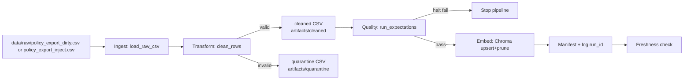

# Kiến trúc pipeline — Lab Day 10

**Nhóm:** aicb_day10_team  
**Cập nhật:** 2026-04-15

---

## 1. Sơ đồ luồng (bắt buộc có 1 diagram: Mermaid / ASCII)

- **run_id** được ghi trong log và metadata khi embed.
- **freshness** đo tại boundary publish qua `manifest_<run_id>.json`.
- **quarantine** là boundary tách dữ liệu không hợp lệ trước validate/embed.

---

## 2. Ranh giới trách nhiệm

| Thành phần | Input | Output | Owner nhóm |
|------------|-------|--------|--------------|
| Ingest | `data/raw/*.csv` | `rows[]` trong memory + `raw_records` log | Ingestion Owner |
| Transform | `rows[]` | `cleaned_<run_id>.csv`, `quarantine_<run_id>.csv` | Cleaning Owner |
| Quality | cleaned rows | expectation result + halt/warn | Quality Owner |
| Embed | cleaned CSV | Chroma collection `day10_kb` | Embed Owner |
| Monitor | manifest JSON | trạng thái PASS/WARN/FAIL freshness | Monitoring Owner |

---

## 3. Idempotency & rerun

- Embed dùng `upsert(ids=chunk_id)` nên rerun không tạo duplicate vector.
- Mỗi lần publish, pipeline đọc toàn bộ id hiện có trong collection và **prune** id không còn trong cleaned snapshot (`embed_prune_removed`).
- Kết quả: index phản ánh chính xác trạng thái cleaned run mới nhất, tránh stale context ở top-k.

---

## 4. Liên hệ Day 09

- Day 10 tạo/tái tạo index `day10_kb` từ export sạch trước khi agent Day 09 query.
- Khi cần tích hợp lại orchestration Day 09, chỉ cần trỏ retriever sang collection đã publish của Day 10.
- Cách này tách rõ trách nhiệm: Day 10 đảm bảo chất lượng dữ liệu; Day 09 tập trung orchestration/prompt.

---

## 5. Rủi ro đã biết

- Dữ liệu mẫu có `exported_at` cũ nên freshness thường `FAIL` nếu SLA 24h.
- Rule allowlist có thể drop dữ liệu hợp lệ mới nếu quên cập nhật contract.
- Nếu bật `--skip-validate` có thể embed dữ liệu xấu; chỉ dùng cho inject demo.

---

## 6. Evidence run thực tế

- `run_id=inject-bad`: expectation `refund_no_stale_14d_window` FAIL có chủ đích, `embed_prune_removed=2`.
- `run_id=sprint3-fix`: expectation pass lại toàn bộ halt checks, `embed_prune_removed=1`.
- Cặp eval minh chứng before/after: `artifacts/eval/after_inject_bad.csv` và `artifacts/eval/before_after_eval.csv`.
